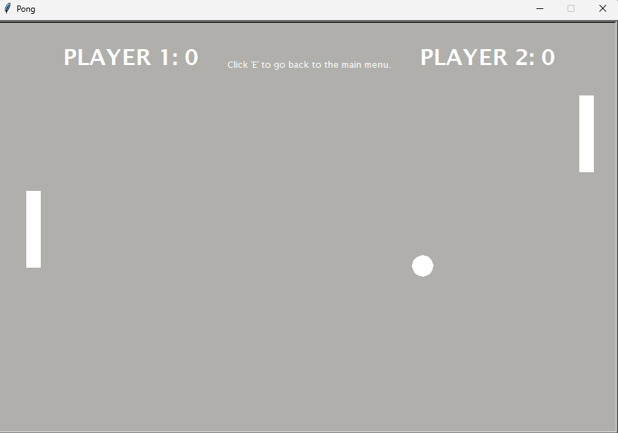

# Pong
Pong is a classic desktop ping pong game (with some variations) made in Python.
### 
### 
## Overview
There are currently 3 different game modes. 
* Normal - Your standard Pong game. Everything stays the same the entire duration of the game.
* Speed - Everytime the ball collides with something (whether its the wall or the paddles), it increases in speed by a certain factor until someone scores a point. After a point is scored, the ball returns to its original speed.
* Large Paddles - The name itself is pretty self-explanatory, each player gets larger paddles which makes it slightly difficult for them to score against each other. *If the user chooses to play with an AI, the AI's paddle is slightly smaller, but still larger than the paddles in other gamemodes. This was done as I found it slightly too difficult to score against it if the paddles were the same size.*

There is also an option that allows you to play against an AI. This AI uses very simple code (all it does is follow the y-coordinate of the ball at a set speed).

The gamemodes and AI toggle can be chosen by clicking their respective 'buttons'.

## How do I run the game?
You can download the executable either from the 'Releases' tab or the 'pong.zip' in the master branch. If you download the executable from 'Releases', you **must** also download the Assets folder (master branch) or the program will not run. If you download the 'pong.zip', make sure you extract it before trying to run it. *I was testing out the releases feature hence why there's 2 ways to download the program.*
